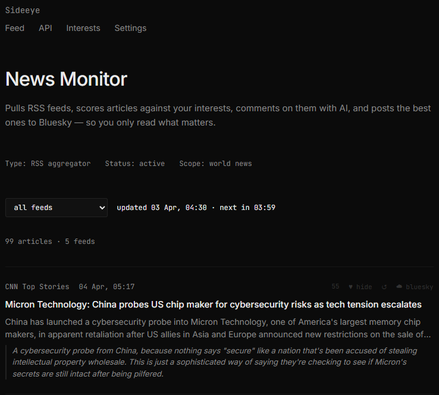



# Sideeye

A self-hosted news reader and social media agent with AI commentary and Bluesky posting.

Aggregates RSS feeds, scores articles against your interests, generates witty one-liner comments via a hosted LLM, and lets you post directly to Bluesky — all from a minimal dark-theme web UI.

  

---

## Features

- **RSS aggregation** — polls configurable feeds every 5 minutes; live push via Server-Sent Events
- **Interest scoring** — ranks articles by keyword match against your topic list (0–10 per topic)
- **Content filtering** — blacklist keywords to suppress unwanted categories entirely
- **AI commentary** — per-article witty comments via DeepInfra (Llama 3.1 8B); auto-comments articles scoring above 40; regenerate anytime
- **Bluesky posting** — one-click post to Bluesky with the AI comment attached
- **Settings UI** — two-tab settings page: tune the AI system prompt and temperature (AI tab), manage RSS sources (Sources tab)
- **First-run setup banner** — new users get a dismissable guide on first visits
- **46 automated tests** — covering RSS parsing, content filtering, interest scoring, LLM client, and Bluesky client

---

## Quick start

### 1. Clone and install

```bash
git clone https://github.com/yourname/sideeye.git
cd sideeye
python -m venv .venv
source .venv/bin/activate   # Windows: .venv\Scripts\activate
pip install -r requirements.txt
```

### 2. Configure credentials

```bash
cp .env.example .env
```

Edit `.env` with your own values:

```
DEEPINFRA_API_KEY=your_deepinfra_api_key_here
BLUESKY_HANDLE=yourhandle.bsky.social
BLUESKY_APP_PASSWORD=xxxx-xxxx-xxxx-xxxx
```

- **DeepInfra API key** — sign up at [deepinfra.com](https://deepinfra.com/)
- **Bluesky App Password** — create one at [bsky.app/settings/app-passwords](https://bsky.app/settings/app-passwords) — do not use your main password

### 3. Run

```bash
python main.py
```

Open [http://localhost:8000](http://localhost:8000). On first run, default config files are created automatically and a setup guide is shown in the UI.

---

## Configuration

All three files are created with sensible defaults on first run. Edit them via the web UI or directly.

| File             | Tracked in git | Purpose                                                      |
| ---------------- | -------------- | ------------------------------------------------------------ |
| `feeds.json`     | No             | RSS feed list — editable in Settings → Sources               |
| `interests.json` | No             | Keyword/topic list with scores 0–10 — editable in Interests  |
| `settings.json`  | No             | AI system prompt and temperature — editable in Settings → AI |

See `feeds.example.json`, `interests.example.json`, and `settings.example.json` for the expected format.

---

## Pages

| URL                      | Description                                                     |
| ------------------------ | --------------------------------------------------------------- |
| `/`                      | Main feed — scored articles with AI comment and Bluesky buttons |
| `/static/interests.html` | Manage interest topics and scores                               |
| `/static/settings.html`  | AI prompt, temperature, and RSS sources                         |

---

## API

| Method    | Path            | Description                          |
| --------- | --------------- | ------------------------------------ |
| `GET`     | `/stream`       | SSE stream of live article updates   |
| `GET`     | `/feeds`        | List configured RSS feeds            |
| `PUT`     | `/feeds`        | Update RSS feed list and re-fetch    |
| `GET/PUT` | `/interests`    | Read/write interest topics           |
| `GET/PUT` | `/settings`     | Read/write AI prompt and temperature |
| `POST`    | `/comment`      | Generate AI comment for an article   |
| `POST`    | `/bluesky/post` | Post article to Bluesky              |
| `GET`     | `/health`       | Health check                         |

---

## Tech stack

- [FastAPI](https://fastapi.tiangolo.com/) + [uvicorn](https://www.uvicorn.org/)
- [feedparser](https://feedparser.readthedocs.io/) for RSS parsing
- [httpx](https://www.python-httpx.org/) for async HTTP
- [atproto](https://atproto.blue/) for Bluesky AT Protocol
- [python-dotenv](https://pypi.org/project/python-dotenv/) for secrets

---

## Running tests

```bash
python -m pytest tests/ -v
```

---

## License

MIT

Aggregates RSS feeds, scores articles against your interests, generates witty AI comments via DeepInfra, and lets you post directly to Bluesky — all from a clean single-page interface.

  

---

## Features

- **RSS aggregation** — polls BBC, DW, Al Jazeera, The Guardian, CNN (configurable)
- **Interest scoring** — ranks articles by keyword match against your topic list
- **Content filtering** — blacklist keywords to suppress categories entirely
- **AI commentary** — per-article witty comments via DeepInfra (Llama 3.1 8B); auto-comments articles with score > 40
- **Bluesky posting** — one-click post to Bluesky with the AI comment attached
- **Settings page** — edit the AI system prompt and temperature from the UI
- **Live updates** — Server-Sent Events push new articles without a page reload

---

## Quick start

### 1. Clone and install

```bash
git clone https://github.com/yourname/sideeye.git
cd sideeye
python -m venv .venv
source .venv/bin/activate   # Windows: .venv\Scripts\activate
pip install -r requirements.txt
```

### 2. Configure credentials

```bash
cp .env.example .env
```

Edit `.env` with your own values:

```
DEEPINFRA_API_KEY=your_deepinfra_api_key_here
BLUESKY_HANDLE=yourhandle.bsky.social
BLUESKY_APP_PASSWORD=xxxx-xxxx-xxxx-xxxx
```

- **DeepInfra API key** — sign up at [deepinfra.com](https://deepinfra.com/)
- **Bluesky App Password** — create one at [bsky.app/settings/app-passwords](https://bsky.app/settings/app-passwords) (do not use your main password)

### 3. Run

```bash
python main.py
```

Open [http://localhost:8000](http://localhost:8000).

---

## Configuration

| File             | Purpose                                           |
| ---------------- | ------------------------------------------------- |
| `feeds.json`     | RSS feed list (name, url, category)               |
| `interests.json` | Keyword/topic list with scores                    |
| `settings.json`  | AI system prompt and temperature (editable in UI) |

All three files are created with defaults on first run if missing.

---

## API

| Method    | Path            | Description                          |
| --------- | --------------- | ------------------------------------ |
| `GET`     | `/articles`     | Cached articles with scores          |
| `GET`     | `/stream`       | SSE stream of live article updates   |
| `GET/PUT` | `/interests`    | Read/write interest topics           |
| `POST`    | `/comment`      | Generate AI comment for an article   |
| `POST`    | `/bluesky/post` | Post article to Bluesky              |
| `GET/PUT` | `/settings`     | Read/write AI prompt and temperature |
| `GET`     | `/health`       | Health check                         |

---

## Tech stack

- [FastAPI](https://fastapi.tiangolo.com/) + [uvicorn](https://www.uvicorn.org/)
- [feedparser](https://feedparser.readthedocs.io/) for RSS parsing
- [httpx](https://www.python-httpx.org/) for async HTTP
- [atproto](https://atproto.blue/) for Bluesky AT Protocol
- [python-dotenv](https://pypi.org/project/python-dotenv/) for secrets

---

## Running tests

```bash
python -m pytest tests/ -v
```

46 tests covering RSS parsing, content filtering, interest scoring, LLM client, and Bluesky client.

---

## License

MIT
